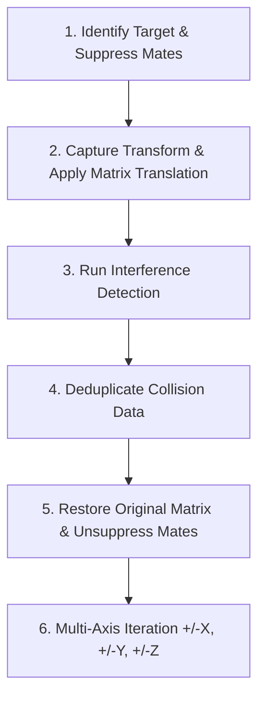

# SolidWorks Automation Engine (SW-Automation-Engine)

**Version:**  1.0.0  
**Author:** Hadi Menzilcioğlu  
**Target Audience:** Mechanical Design Engineers, CAD Automation Developers, DFM / QC Specialists  

---

# Executive Summary & Objectives

## Problem Definition
Following the completion of 3D CAD modeling in SolidWorks, mechanical designs undergo quality control and verification procedures. In traditional workflows, checking the validation items (such as interference checks, clearance limits, hole specifications, and BOM verification) is performed manually. This manual process is time-consuming, prone to human oversight, and adds friction to engineering release schedules.

## Purpose
The primary objective of this project is to automate repetitive CAD verification workflows, streamline design-for-manufacturing (DFM) checks, and accelerate the engineering release-to-production pipeline through algorithmic automation.

## Methodology
Interfacing directly with SolidWorks via the official .NET COM Interop API to automate mechanical inspections, extract geometric metadata, run virtual tolerance/clearance tests, and export structured reports.

### API Reference
- [Official SolidWorks API Documentation](https://help.solidworks.com/2020/english/api/help_list.htm?id=2)

## Key Automated Verification Capabilities
The engine currently automates 6 core inspection workflows:
- **BOM (Bill of Materials) Generation**: Automated component counting and assembly tree breakdown.
- **Mass & Physical Properties Analysis**: Mass, volume, and surface area calculation.
- **Fillet & Radius Analysis**: Parametric feature tree and direct B-Rep surface inspection.
- **Hole Wizard Analysis**: Standard fastener size, hole depth, thread depth, and counterbore/countersink extraction.
- **Interference Analysis**: Solid body collision detection with automated deduplication.
- **Clearance & Tolerance Testing**: Multi-axis virtual displacement testing for dynamic clearance validation.

Additionally, the underlying `SolidWorks_Lib` C# library provides a modular foundation for building custom CAD automation scripts and plugins.

## Proposed Recommendation
This automation library is expected to significantly accelerate the transition of parts from design to production. Given that certain features are still evolving toward their full potential, continued active development of the library is recommended.

---

# System Architecture and Data Models

## Architecture & Design Philosophy
The system is designed with a focus on **sustainability**, **scalability**, and **fault isolation**. Rather than relying on monolithic, single-purpose scripts, the engine employs a modular architecture where core CAD operations, data transfer objects (DTOs), and CLI runners are decoupled. This prevents cascading side-effects when modifying individual functions and simplifies debugging.

## Data Models & COM Decoupling
Extracting live COM objects from SolidWorks can introduce significant memory overhead and process lockups. To mitigate this, raw COM data is immediately parsed, mapped into lightweight C# DTOs (such as `HoleWizardData`), and decoupled from COM lifecycles. This minimizes memory consumption, prevents process leaks, and accelerates downstream processing.

## SolidWorks Engine Structure (Facade Pattern)
The library provides high-level orchestration via a **Facade** architectural pattern (`SolidWorksEngine`). The facade encapsulates complex SolidWorks API calls into intuitive, high-level methods, allowing developers to write concise automation scripts without dealing directly with low-level COM mechanics.

### Architectural Note: Preventing a "God Class"
To prevent `SolidWorksEngine` from expanding into an unmaintainable "God Class", domain functions can be further segregated into specialized modules (e.g., `SolidWorksEngine_IO`, `SolidWorksEngine_Modeling`, `SolidWorksEngine_Assembly`).

## Scripting & Application
Standalone CLI tools have been developed for the verification workflows. While designed as prototypes, this infrastructure allows custom, production-grade scripts to be built rapidly.

## Data Pipeline
Analysis results are decoupled from the CAD environment and can be exported directly to standard `.csv` files for downstream analysis in Python, Pandas, Excel, or ERP/PLM integrations.

---

# Core API Reference

## HoleWizardData Model (DTO)
A strongly typed data transfer object representing geometric, dimensional, and manufacturing metadata extracted from SolidWorks Hole Wizard features.

| Property | Type | Description |
| :--- | :--- | :--- |
| **`FeatureName`** | `string` | Feature name (e.g., `"M3 Clearance Hole1"`, `"M2.5x0.45 Tapped Hole2"`) |
| **`HoleType`** | `string` | Hole type (`"Tap"`, `"Counterbore"`, `"Countersink"`, `"Simple Hole"`, `"Pipe Tap"`) |
| **`FastenerSize`** | `string` | Fastener designation (e.g., `"M3"`, `"M2.5x0.45"`, `"#4-40"`) |
| **`Standard`** | `string` | Standard specification (e.g., `"ISO"`, `"DIN"`, `"ANSI Metric"`) |
| **`HoleDiameter`** | `double` | Drill / hole diameter (mm) |
| **`NominalDiameter`** | `double` | Nominal diameter resolved from `FastenerSize` (mm) |
| **`HoleDepth`** | `double` | Total hole depth (mm) |
| **`ThreadDepth`** | `double` | Threaded depth (mm) |
| **`IsThroughAll`** | `bool` | Indicates whether the hole is Through All |
| **`EndCondition`** | `string` | Hole end condition (`"Through All"`, `"Blind"`) |
| **`CounterBoreDiameter`** | `double` | Counterbore diameter (mm) |
| **`CounterBoreDepth`** | `double` | Counterbore depth (mm) |
| **`CounterSinkDiameter`** | `double` | Countersink diameter (mm) |
| **`CounterSinkAngle`** | `double` | Countersink angle (°) |
| **`IsFlagged`** | `bool` | Indicates if a DFM / manufacturability rule violation was detected |
| **`FlagReason`** | `string` | Description of warning or rule violation |

---

### 1. Session & Lifecycle Management
Core methods for initializing and safely terminating communication with SolidWorks.

| Method | Return Type | Parameters | Description |
| :--- | :--- | :--- | :--- |
| **`Start_SW`** | `bool` | `bool head = false` | Launches SolidWorks in headless/background mode (`false`) or visible GUI mode (`true`). |
| **`Stop_SW`** | `bool` | *None* | Terminates the active SolidWorks session and safely releases COM memory to prevent leaks. |
| **`Get_Active_Document`** | `bool` | *None* | Captures the currently active document in SolidWorks and assigns it to `activeModel`. |

---

### 2. File, Document & User Interaction
Methods for managing part/assembly files and prompting for user input via the SolidWorks UI.

| Method | Return Type | Parameters | Description |
| :--- | :--- | :--- | :--- |
| **`Create_New_Part`** | `bool` | *None* | Creates a new `.sldprt` document using the default Part template. |
| **`Open_Document`** | `bool` | `string filePath` | Opens a `.sldprt` or `.sldasm` file from disk and sets it as the active document. |
| **`Save_Part`** | `bool` | `string folderPath`, `string fileName`, `bool confirm` | Saves the active part to the specified folder. Prompts for confirmation if `confirm` is true. |
| **`Create_Part_Folder`** | `string` | `string folderName` | Creates an export/output directory in the working folder and returns its full path. |
| **`Change_Measure_System`** | `bool` | `string unitType` | Updates document unit system (`"mmgs"`, `"ips"`, `"mks"`, `"cgs"`). |
| **`Write_Message`** | `void` | `string message` | Displays an informational pop-up dialog in the SolidWorks UI. |
| **`Ask_Confirm`** | `bool` | `string question` | Prompts the user with a Yes/No dialog in SolidWorks; returns `true` or `false`. |

---

### 3. Geometric & Mass Property Analysis
Analysis tools for extracting physical properties and DFM parameters from CAD models.

| Method | Return Type | Parameters | Description |
| :--- | :--- | :--- | :--- |
| **`Get_Mass_Properties`** | `Dictionary<string, double>` | *None* | Computes mass (kg), volume (m³), and surface area (m²) for the active part. |
| **`Get_Feature_Tree`** | `Dictionary<string, string>` | *None* | Traverses the Feature Manager design tree, returning a map of feature names and types. |
| **`Inspect_Fillets`** | `Dictionary<string, double>` | *None* | Scans parametric `Fillet` features and returns their radii in millimeters (mm). |
| **`Inspect_Hole_Wizards`** | `List<HoleWizardData>` | *None* | Scans `"HoleWzd"` features, accesses hole definitions via COM locks, and returns `List<HoleWizardData>`. |

---

### 4. Assembly, Interference & Clearance Analysis
Engines for detecting component relations and physical collisions across assembly environments.

| Method | Return Type | Parameters | Description |
| :--- | :--- | :--- | :--- |
| **`Get_Components`** | `List<string>` | *None* | Returns a list of sub-component names for assemblies, or the part name for single parts. |
| **`Generate_BOM`** | `Dictionary<string, int>` | *None* | Traverses the assembly structure and computes component quantities (Bill of Materials). |
| **`Get_Interferences`** | `Dictionary<string, string>` | `bool treatCoincidence = false`, `bool include_Screws = true` | Detects solid body collisions. Sub-assemblies are treated as single rigid bodies. Optional hardware exclusion (`include_Screws: false`). |
| **`Eliminate_Duplicate_Collisions`** | `Dictionary<string, string>` | `Dictionary<string, string> collisionDict` | Deduplicates collision pairs (filtering out redundant `A-B` vs `B-A` entries). |
| **`Shift_Component_And_Analyze_Clearance`** | `Dictionary<string, string>` | `string componentName`, `double deltaX, deltaY, deltaZ`, `bool treatCoincidence = false`, `bool include_Screws = false` | Suppresses mates on a target component, applies a virtual translation vector, runs interference detection, and restores the component to its original state. |

---

### 5. Data Export & Reporting
Utilities for persisting analysis data and capturing visual documentation.

| Method | Return Type | Parameters | Description |
| :--- | :--- | :--- | :--- |
| **`Export_Dict_To_Csv`** | `bool` | `Dictionary<TKey, TValue> data`, `string filePath` | Exports dictionary data to standard two-column (`Key,Value`) CSV format compatible with Excel and Pandas. |
| **`Take_Feature_Screenshot`** | `bool` | `string featureName`, `string exportFolderPath` | Selects a specific feature, focuses the camera (`ZoomToSelection`), saves a JPG screenshot, and resets the view (`ZoomToFit`). |

---

# Clearance & Tolerance Analysis Methodology

Clearance analysis performs a "virtual vibration/displacement test" without modifying the physical assembly or permanently breaking mates. The automation follows a 6-step workflow:



### 1. Target Identification & Mate Suppression
Before displacing a component, its active mates must be temporarily suppressed:
* The system locates the component in the Feature Tree by exact or partial name matching.
* Traverses all `MateGroup` and `Mate` features in the assembly.
* Suppresses all mates linked to the target component in the active configuration.

### 2. Original Position Capture & Transformation Matrix Translation
SolidWorks represents 3D spatial orientation and position using a **4×4 Homogeneous Transformation Matrix**:

$$T = \begin{bmatrix} R_{11} & R_{12} & R_{13} & T_x \\ R_{21} & R_{22} & R_{23} & T_y \\ R_{31} & R_{32} & R_{33} & T_z \\ 0 & 0 & 0 & 1 \end{bmatrix}$$

Where $R$ is the $3\times3$ rotation submatrix, and $T$ is the $3\times1$ translation vector. The API retrieves this matrix via `Transform2.ArrayData` as a 16-element array. Indices 9, 10, and 11 represent $T_x$, $T_y$, and $T_z$ (in meters).

The translation is applied while keeping orientation constant, modifying only the translation components with user-specified offsets $\Delta X, \Delta Y, \Delta Z$ (converted from mm to meters):

$$\begin{bmatrix} T_{x_{\text{new}}} \\ T_{y_{\text{new}}} \\ T_{z_{\text{new}}} \end{bmatrix} = \begin{bmatrix} T_{x_{\text{old}}} \\ T_{y_{\text{old}}} \\ T_{z_{\text{old}}} \end{bmatrix} + \begin{bmatrix} \frac{\Delta X}{1000} \\ \frac{\Delta Y}{1000} \\ \frac{\Delta Z}{1000} \end{bmatrix}$$

The resulting transformation matrix (`mathUtil.CreateTransform`) is assigned to the component to translate it virtually.

### 3. Interference Detection Execution
While displaced, solid body interferences are evaluated:
* SolidWorks collision detection engine is invoked (`Get_Interferences`).
* Sub-assemblies are treated as rigid bodies; hidden components are excluded.
* Optional filtering eliminates fastener/Toolbox hardware contacts.

### 4. Collision Deduplication
Raw collision lists often report reciprocal collisions. The `Eliminate_Duplicate_Collisions` method unifies entries like `Part A - Part B` and `Part B - Part A` into unique pair records.

### 5. Assembly Restoration
To preserve model integrity after testing:
* The cached original transformation matrix is reapplied to the component.
* All suppressed mates are unsuppressed.
* `EditRebuild3` is invoked to recalculate assembly kinematics and rebuild geometry.

### 6. Multi-Axis Automated Sweep
The `Analyze_Clearance_All_Axes` method iterates through independent directions ($+X, -X, +Y, -Y, +Z, -Z$), aggregating collision states into a unified `ClearanceResult` summary report.

---

# Development Standards & Best Practices

## COM Memory Management
SolidWorks API is built upon COM (Component Object Model). While `SolidWorksEngine` manages its internal lifecycle, custom scripts extending the library must adhere to memory management rules:
* When iterating through collections of SolidWorks objects (e.g., `Feature`, `Face`, `Component2`), the .NET Garbage Collector cannot automatically reclaim unmanaged COM references.
* To prevent memory leaks and dangling background `SLDWORKS.exe` processes, unmanaged objects must be explicitly released using `System.Runtime.InteropServices.Marshal.ReleaseComObject()`.

## Threading & STAThread Requirement
The SolidWorks UI and COM server operate strictly in a **Single-Threaded Apartment (STA)** model:
* All external C# applications (Console or Windows Forms) calling the API must decorate their `Main()` entry point with the `[STAThread]` attribute.
* Neglecting this attribute can cause COM deadlocks, unresponsive calls, or sudden application crashes.

## Selection Locks & Exception Safety
Methods accessing deep feature definitions lock the document feature tree:
* **Critical Rule:** Any call to `AccessSelections()` must be enclosed in a `try-finally` block ensuring `ReleaseSelectionAccess()` is executed.
* If an unhandled exception bypasses `ReleaseSelectionAccess()`, the part remains permanently locked in Read-Only mode until SolidWorks is restarted.

## Null Checks & Resilient Error Handling
SolidWorks API methods frequently return `null` rather than throwing managed exceptions when an entity is missing:
* Always perform null checks on objects returned from API calls.
* Wrap critical COM search and traversal operations in `try-catch` blocks to handle `COMException` and `NullReferenceException` gracefully.

---

# Sample CLI Applications

The `Scripts/` directory contains standalone C# Console applications demonstrating specific automation workflows. Each script references `SolidWorks_Lib.csproj`, controls SolidWorks (headlessly or with UI), and exports results:

* **`AnalyzeHoles`**: Inspects Hole Wizard features, reporting standard designations, diameters, and depths.
* **`ClearanceAnalysis`**: Translates target components along coordinate axes to test dynamic clearances.
* **`ExtractBOM`**: Generates a Bill of Materials with component counts from assembly structures.
* **`InspectFillet`**: Scans fillet features and automatically captures focused screenshots.
* **`InterferenceAnalysis`**: Scans assemblies for physical collisions, exporting deduplicated CSV reports.
* **`MassAnalysis`**: Computes mass, volume, and surface area properties.

### Building & Publishing Single-File Binaries
From the terminal (PowerShell or CMD), navigate to the script directory and publish a self-contained single-file executable:
```powershell
cd Scripts\InterferenceAnalysis
dotnet publish -c Release -r win-x64 --self-contained true -p:PublishSingleFile=true -p:IncludeNativeLibrariesForSelfExtract=true
```

_Note: When executed, the CLI will prompt for the full path of the target SolidWorks document._

---

# Future Roadmap

The following enhancements are planned to expand the library's capabilities:

- [ ] **Enhanced Hole Data CSV Export**: Standardized CSV schema with complete tolerance and fastener class mappings.
- [ ] **Exact Hole Instance Counting**: Algorithmic detection of sketch points beneath hole features to count actual drilled instances per pattern.
- [ ] **Intelligent BOM Filtering & Categorization**: Automated filtering to separate custom-machined parts from off-the-shelf fasteners and commercial catalog hardware.
- [ ] **Batch Component-Focused Screenshotting**: Iterating assembly components, isolating each part by hiding surrounding geometry, and taking focused screenshots with automated zoom-to-fit framing.
- [ ] **Automated Conformal Cover Generator**: Procedural modeling tool that extracts external enclosure contours to generate mating conformal covers.
- [ ] **Parallel Wall Distance Verifier**: Automated scanning of thin-wall geometries and minimum parallel face clearances.
- [ ] **Fastener Engagement & Thread Depth Validation**: Cross-referencing threaded hole depth against engaged fastener length from standard hardware libraries.

---

# Troubleshooting & FAQs

### Detailed Component Collisions Missing in PCB Analysis
If a PCB is imported as a single multi-body part (`.sldprt`), SolidWorks treats the entire board as a single rigid solid block. To analyze individual surface-mount components, ICs, or connectors, the board must be imported as an assembly (`.sldasm`) with each component represented as a distinct sub-component.

### Application Crashes on Startup
Ensure the `Main()` method is marked with `[STAThread]`. SolidWorks COM calls will fail in multi-threaded apartment environments.

### Document Not Found During Concurrent Executions
If running scripts in headless mode while another interactive SolidWorks session is active, `Get_Active_Document` may attach to an unintended document. When automating headless pipelines, specify explicit absolute file paths with `Open_Document()` rather than relying on active document context.
